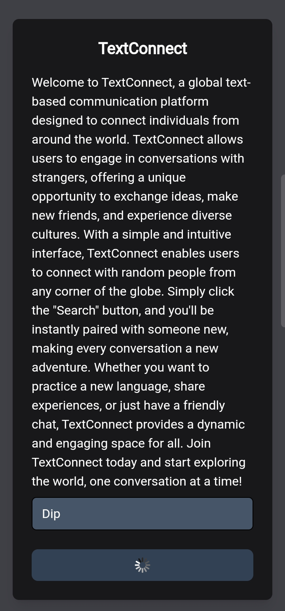
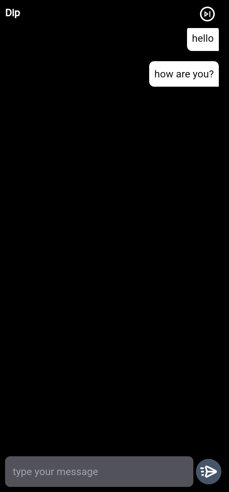

# Text-Based Random Chat System

## Description

This repository contains the code for a text-based random chat system similar to Omegle. Users can engage in real-time text conversations with randomly selected users based on a waiting list. The application is built with Flask, Firebase, and Socket.IO, providing secure authentication, real-time data synchronization, and interactive chat functionality.

## Features

- **Firebase Authentication**: Securely authenticate users using Firebase.
- **Real-Time Database**: Synchronize user data and chat information in real-time with Firebase.
- **Server-Side Sessions**: Manage user sessions securely on the server.
- **Real-Time Chat**: Enable real-time text-based conversations using Socket.IO.
- **User Geolocation**: Fetch and display user geolocation information.

## Use Case

This application is designed for scenarios where users want to have anonymous, real-time text conversations with random strangers. It can be used for:

- Random chat applications
- Anonymous support systems
- Any platform requiring random user pairing for text communication

## Architecture

- **Frontend**: HTML/CSS with Flask templating.
- **Backend**: Flask framework, Firebase Admin SDK, and Flask-SocketIO.
- **Database**: Firebase Real-Time Database.

## Setup

1. **Clone the repository:**

    ```sh
    git clone https://github.com/bytebrain3/TextConnect.git
    cd repository
    ```

2. **Install dependencies:**

    ```sh
    pip install -r requirements.txt
    ```

3. **Setup Firebase Credentials:**

    - Download your Firebase service account key as `cred.json`.
    - Place the `cred.json` file in the root directory of your project.

4. **Run the application:**

    ```sh
    python app.py
    ```

## Screenshot

Here is an example screenshot of the application in action:





## Routes

- **`/`**: Home page. Redirects to chat page if the user is already logged in.
- **`/ip_info/01100100_01100101_01110110_01101001_01101100`**: Fetches public IP information.
- **`/submit-username`**: Endpoint to submit a username and create a new Firebase user.
- **`/chat_page`**: Chat page for logged-in users.

## Socket.IO Events

- **`connect`**: Triggered when a user connects. Adds the user to the online list.
- **`disconnect`**: Triggered when a user disconnects. Removes the user from the online list and handles room cleanup.
- **`join`**: Triggered when a user attempts to join a chat. Matches the user with another online user.
- **`leave`**: Triggered when a user leaves the chat room.
- **`typing`**: Indicates that a user is typing.
- **`stop typing`**: Indicates that a user has stopped typing.
- **`message`**: Handles incoming messages and broadcasts them to the room.

## Workflow

1. **User Registration**: Users register by submitting a username. This creates a new Firebase user and stores user information in the database.
2. **Geolocation Fetching**: The application fetches and stores the user's geolocation information.
3. **Waiting List**: Users are added to a waiting list upon connection.
4. **User Matching**: When a user joins, they are matched with another waiting user. A room is created for the conversation.
5. **Real-Time Chat**: Users can chat in real-time until one of them leaves the room.
6. **Room Cleanup**: When a user leaves, the room and user information are cleaned up from the database.

## Contributing

Feel free to open issues or submit pull requests if you find any bugs or have suggestions for improvements.

## License

This project is licensed under the MIT License. See the [LICENSE](LICENSE) file for more details.


